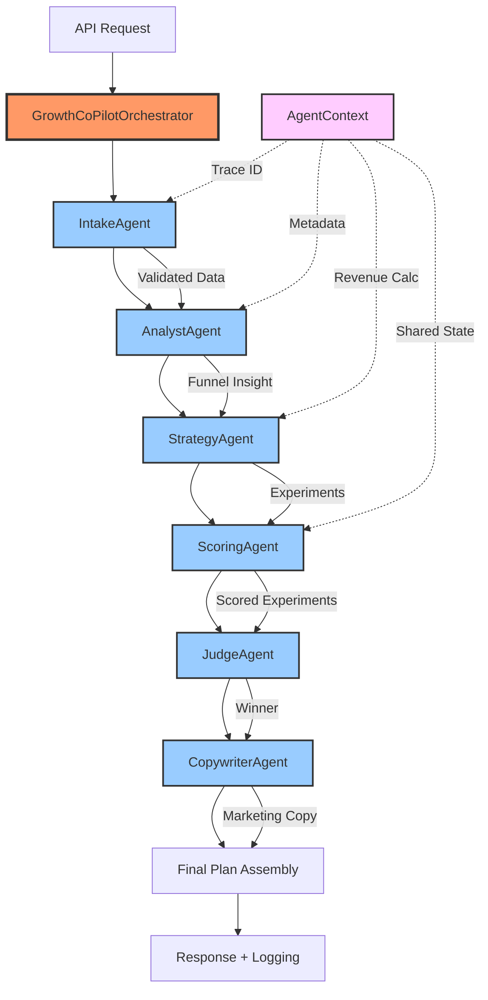

# SME Growth Co-Pilot 🚀

**Version:** 0.1.0  
**Status:** Active Development  
**Maintainer:** Christopher Crilly Pienaah

[](https://www.python.org/downloads/)
[](https://fastapi.tiangolo.com/)
[](https://ai.google.dev/gemini-api)
[](https://www.kaggle.com)
[](LICENSE)
[](https://github.com/psf/black)

---

## 📖 Overview

SME Growth Co-Pilot is an **enterprise-grade AI agent** that transforms small business KPIs into data-driven, actionable growth strategies. Built with FastAPI and powered by Google Gemini, it automates funnel analysis, experiment prioritization, and strategic planning—delivering insights that typically require expensive consultants.

### What It Does

- 📊 **Automated Funnel Analysis** - Identifies conversion bottlenecks across visits→leads→signups→purchases
- 💡 **Smart Experiment Generation** - Proposes targeted growth initiatives based on detected problems
- 🎯 **ICE Prioritization** - Scores experiments by Impact, Confidence, and Effort for data-driven decisions
- 🤖 **AI Strategy Commentary** - Gemini-powered business reasoning explaining the "why" behind recommendations
- ✍️ **Marketing Copy Generation** - Creates ready-to-use campaign messaging
- 📁 **Flexible Data Input** - Accept JSON requests or upload CSV files directly
- 🏗️ **Multi-Agent Architecture** - 6 specialized AI agents working collaboratively with full observability
- 💰 **Revenue Opportunity Analysis** - Calculates potential revenue from fixing identified bottlenecks
- 💾 **Historical Tracking** - Logs all plans for trend analysis and continuous improvement
---

## 🎯 System Architecture

### Multi-Agent Workflow

The system uses **6 specialized AI agents** that work collaboratively to generate growth strategies:


### Agent Responsibilities

**🔍 IntakeAgent** - Request Validation
- Validates KPI data quality
- Checks for impossible ratios (e.g., purchases > signups)
- Flags data quality warnings
- Ensures clean data for downstream agents

**📊 AnalystAgent** - Funnel Diagnosis
- Identifies biggest conversion bottleneck
- Calculates conversion rates at each stage
- Estimates revenue opportunity from fixing issues
- Example: "$6,930 potential revenue if visits→leads bottleneck is fixed"

**💡 StrategyAgent** - Experiment Generation
- Proposes context-aware growth experiments
- Matches experiments to detected bottlenecks
- Considers business constraints and channels
- Generates 2-6 targeted recommendations

**🎯 ScoringAgent** - ICE Prioritization
- Scores experiments: (Impact × Confidence) / Effort
- Ranks experiments by priority score
- Provides scoring rationale
- Example: Referral Program scores 7.5 (Impact:5, Confidence:3, Effort:2)

**✍️ CopywriterAgent** - Marketing Copy
- Generates ready-to-use campaign messaging
- Adapts to business tone and voice
- Creates channel-specific copy (email, social, in-store)
- Provides complete campaign text

**⚖️ JudgeAgent** - Decision & Explanation
- Selects #1 experiment to prioritize
- Generates AI-powered strategy explanation (via Gemini)
- Explains WHY this experiment is best
- Provides actionable next steps

### Agent Communication

All agents share an **AgentContext** containing:
- **Trace ID**: Unique identifier for request tracking (e.g., `cf26769b`)
- **Metadata**: Shared data between agents (revenue opportunities, warnings, metrics)
- **History**: Complete audit trail of agent actions

**Example trace log:**
```
INFO: agent.Intake - [cf26769b] Intake: Validating request
INFO: agent.Analyst - [cf26769b] Revenue opportunity: $6,930.00
INFO: agent.Strategy - [cf26769b] Strategy: Experiments proposed
INFO: agent.Scoring - [cf26769b] Scoring: Top: Referral Program (7.5)
INFO: agent.Judge - [cf26769b] Judge: Winner selected
INFO: agent.Copywriter - [cf26769b] Copywriter: Copy generated
```
---

## 🤖 Multi-Agent Architecture

### Why Multi-Agent?

Instead of a single monolithic function, the system uses **6 specialized agents** that collaborate like a real consulting team:

**Benefits:**
- ✅ **Separation of Concerns** - Each agent focuses on one task
- ✅ **Independent Testing** - Test each agent in isolation
- ✅ **Easy to Extend** - Add new agents without touching existing ones
- ✅ **Swappable Components** - Replace individual agents (e.g., swap Gemini for GPT-4)
- ✅ **Full Observability** - Trace every step with unique IDs
- ✅ **Graceful Degradation** - If one agent fails, others continue

### Agent Workflow Example
```
Request: Coffee shop with 2,000 visits, 350 leads

IntakeAgent:     ✅ Validates data quality
AnalystAgent:    📊 "82.5% drop visits→leads, $6,930 opportunity"
StrategyAgent:   💡 "Propose: Referral Program + Lead Magnet"
ScoringAgent:    🎯 "Referral: 7.5, Lead Magnet: 6.7"  
JudgeAgent:      ⚖️ "Select: Referral Program (highest score)"
CopywriterAgent: ✍️ "Subject: A thank-you from Neighborhood Coffee Hub..."
JudgeAgent:      🤖 "Strategy: Low effort, leverages trust, email fits constraints"

Result: Complete growth plan with reasoning
```

### Enabling Multi-Agent Mode
```bash
# Enable multi-agent architecture
$env:USE_MULTI_AGENT = "true"  # Windows
export USE_MULTI_AGENT="true"  # Mac/Linux

# Restart server
uvicorn app.main:app --reload
```

Check logs to see agents in action:
```
INFO: agent.Intake - [cf26769b] Intake: Validating request
INFO: agent.Analyst - [cf26769b] Revenue opportunity: $6,930.00
...
```

**Feature Flag:** Multi-agent mode is optional - the system falls back to monolithic logic if disabled, ensuring zero-downtime deployment.

---
---

## 🛠️ Tech Stack

| Component | Technology | Purpose |
|-----------|-----------|---------|
| **Backend Framework** | FastAPI | High-performance async API |
| **Agent Architecture** | Custom Multi-Agent System | 6 specialized agents with orchestration |
| **Data Validation** | Pydantic | Type-safe schemas & models |
| **AI Engine** | Google Gemini 2.0 Flash | LLM-powered strategy generation |
| **Data Processing** | Pandas | CSV parsing & data transformation |
| **Storage** | JSONL | Append-only historical logging |
| **Testing** | Pytest | Unit & integration tests |
| **Observability** | Python Logging | Agent tracing & debugging |
| **Documentation** | OpenAPI/Swagger | Auto-generated interactive docs |

---

## 📁 Project Structure
```
sme-growth-copilot/
├── app/
│   ├── agents/                  # Multi-agent system
│   │   ├── __init__.py
│   │   ├── base.py             # BaseAgent & AgentContext
│   │   ├── intake.py           # Request validation
│   │   ├── analyst.py          # Funnel diagnosis
│   │   ├── strategy.py         # Experiment generation
│   │   ├── scoring.py          # ICE prioritization
│   │   ├── copywriter.py       # Copy generation
│   │   └── judge.py            # Winner selection & commentary
│   ├── __init__.py
│   ├── main.py                 # FastAPI app & endpoints
│   ├── orchestrator.py         # Multi-agent workflow coordinator
│   ├── schemas.py              # Pydantic models
│   ├── logic.py                # Legacy business logic (being phased out)
│   ├── parsers.py              # CSV parsing & data extraction
│   ├── llm_strategy.py         # Gemini integration
│   └── storage.py              # JSONL persistence layer
├── data/
│   └── plan_log.jsonl          # Historical plans (auto-created)
├── docs/
│   └── multi-agent-design.md   # Architecture design document
├── examples/
│   ├── sample_payload.json     # Example JSON request
│   └── sample_data.csv         # Example CSV upload
├── tests/
│   ├── test_logic.py           # Unit tests for business logic
│   └── test_parsers.py         # Unit tests for CSV parsing
├── screenshots/                # API documentation images
├── requirements.txt            # Python dependencies
├── USAGE.md                    # Detailed usage guide
├── README.md                   # This file
└── LICENSE                     # MIT License
```

---

## 🚀 Quick Start

### Prerequisites

- Python 3.10+
- Google Gemini API key ([Get one here](https://aistudio.google.com/apikey))

### Installation
```bash
# Clone the repository
git clone https://github.com/CrillyPienaah/sme-growth-copilot.git
cd sme-growth-copilot

# Create virtual environment
python -m venv .venv

# Activate (Windows PowerShell)
.venv\Scripts\activate

# Activate (Mac/Linux)
source .venv/bin/activate

# Install dependencies
pip install -r requirements.txt

# Set API key (Windows)
$env:GOOGLE_API_KEY = "your-api-key-here"

# Set API key (Mac/Linux)
export GOOGLE_API_KEY="your-api-key-here"

# Start the server
uvicorn app.main:app --reload
```

### Verify Installation
```bash
# Health check
curl http://127.0.0.1:8000/health

# Interactive API docs
open http://127.0.0.1:8000/docs
```

### Test with Sample Data

**Option 1: JSON Request**
```bash
curl -X POST "http://127.0.0.1:8000/plan" \
  -H "Content-Type: application/json" \
  -d @examples/sample_payload.json
```

**Option 2: CSV Upload** ⭐ NEW!
```bash
curl -X POST "http://127.0.0.1:8000/plan/from-csv" \
  -F "file=@examples/sample_data.csv"
```

**Or use the interactive docs:**
1. Go to http://127.0.0.1:8000/docs
2. Choose **POST /plan** (JSON) or **POST /plan/from-csv** (file upload)
3. Click **Try it out**
4. Provide data and click **Execute**

You'll get a complete growth plan with funnel analysis, prioritized experiments, and AI strategy!

---

## 💡 How It Works

### 1. Funnel Analysis Engine

The system analyzes three conversion stages:
```python
# Automatic bottleneck detection
visits → leads      # Are you capturing attention?
leads → signups     # Are you building trust?
signups → purchases # Are you closing the deal?
```

**Example Output:**
```json
{
  "from_step": "visits",
  "to_step": "leads",
  "drop_rate": 0.825,
  "comment": "82.5% drop - your biggest opportunity"
}
```

### 2. Experiment Recommendation System

Based on the detected bottleneck, the system proposes context-aware experiments:

| Bottleneck | Recommended Experiments |
|------------|------------------------|
| **Visits → Leads** | Lead magnets, referral programs, content upgrades |
| **Leads → Signups** | Nurture sequences, live demos, onboarding emails |
| **Signups → Purchases** | Loyalty programs, win-back campaigns, purchase incentives |

### 3. ICE Prioritization Framework

Each experiment receives three scores:
```
Priority = (Impact × Confidence) / Effort

Impact:     1-5 (potential growth)
Confidence: 1-5 (likelihood of success)
Effort:     1-5 (implementation difficulty)
```

**Example:**
```json
{
  "experiment": "Referral Program",
  "impact": 5,
  "confidence": 3,
  "effort": 2,
  "priority_score": 7.5  // (5 × 3) / 2
}
```

### 4. AI-Powered Strategy Commentary

Gemini analyzes the business context and explains:
- Why this experiment ranks #1
- How it addresses the specific bottleneck
- Why it fits within stated constraints
- Expected impact on metrics

**Graceful Fallback:** If Gemini is unavailable (rate limits, network issues), the system provides deterministic commentary and continues operating.

---

## 🔌 API Reference

### POST /plan
**Create a growth plan from business KPIs**

Send structured JSON data to generate a growth plan.

**Request:**
```json
{
  "business_profile": {
    "business_id": "coffee_001",
    "name": "Downtown Cafe",
    "industry": "Food & Beverage",
    "region": "Toronto",
    "main_channels": ["in-store", "email"]
  },
  "kpis": {
    "visits": 2000,
    "leads": 350,
    "signups": 200,
    "purchases": 80,
    "revenue": 8400
  },
  "goal": {
    "objective": "increase repeat purchases",
    "horizon_weeks": 6
  }
}
```

**Response:**
- Full funnel analysis
- 2+ prioritized experiments
- Marketing copy
- AI strategy commentary

---

### POST /plan/from-csv ⭐ NEW!
**Upload a CSV file with business data**

Don't want to format JSON manually? Upload a CSV file instead! Perfect for businesses exporting data from Shopify, Google Analytics, or their CRM.

**CSV Format:**
```csv
business_name,industry,region,channels,visits,leads,signups,purchases,revenue,goal
Coffee Shop,Food & Beverage,Toronto,"email,website",2000,350,200,80,8400,increase sales
```

**Required columns:**
- `business_name`, `industry`, `region`
- `visits`, `leads`, `signups`, `purchases`, `revenue`
- `goal`

**Optional columns:**
- `business_id`, `channels`, `target_audience`, `tone`, `retention_rate`, `horizon_weeks`, `constraints`, `period`

**Using cURL:**
```bash
curl -X POST "http://127.0.0.1:8000/plan/from-csv" \
  -F "file=@examples/sample_data.csv"
```

**Or use interactive docs:**
1. Go to http://127.0.0.1:8000/docs
2. Click **POST /plan/from-csv** → **Try it out**
3. Click **"Choose File"** and select your CSV
4. Click **Execute**

**Example CSV:** See `examples/sample_data.csv` for complete working example.

**Benefits:**
- ✅ No JSON formatting required
- ✅ Export directly from analytics tools
- ✅ Batch process multiple businesses
- ✅ Same powerful analysis as JSON endpoint

---

### GET /plans/{business_id}
**Retrieve historical plans**

Returns all past plans for a business with timestamps.

**Example:**
```bash
curl http://127.0.0.1:8000/plans/demo_sme_001
```

---

### GET /health
**System health check**

Returns `{"status": "ok"}` if operational.

**Example:**
```bash
curl http://127.0.0.1:8000/health
```

---

## 🔧 How to Extend the System

### Add a New Experiment Type

**File:** `app/logic.py`
```python
def propose_experiments(business, goal, insight):
    # Add your custom experiment
    if bottleneck == ("leads", "signups"):
        exps.append(
            GrowthExperiment(
                name="Interactive Product Tour",
                channel="web",
                hypothesis="Guided tours increase signup confidence"
            )
        )
```

### Add a New Funnel Metric

**File:** `app/schemas.py`
```python
class KpiSnapshot(BaseModel):
    visits: int
    leads: int
    signups: int
    purchases: int
    cart_adds: int  # New metric
```

**File:** `app/logic.py`

Update `diagnose_funnel()` to include the new stage.

### Swap Gemini for Another LLM

**File:** `app/llm_strategy.py`
```python
# Replace Gemini client
from openai import OpenAI
client = OpenAI(api_key=os.getenv("OPENAI_API_KEY"))

# Update generate_strategy_commentary()
response = client.chat.completions.create(
    model="gpt-4",
    messages=[{"role": "user", "content": prompt}]
)
```

### Add Custom CSV Column Mappings

**File:** `app/parsers.py`
```python
# Add custom mappings for different CSV formats
COLUMN_MAPPINGS = {
    'shopify': {'visitors': 'visits', 'customers': 'purchases'},
    'analytics': {'sessions': 'visits', 'conversions': 'purchases'}
}
```

### Add Authentication

**File:** `app/main.py`
```python
from fastapi.security import APIKeyHeader

api_key_header = APIKeyHeader(name="X-API-Key")

@app.post("/plan")
async def create_plan(
    request: PlanRequest,
    api_key: str = Depends(api_key_header)
):
    # Validate API key
    if api_key not in valid_keys:
        raise HTTPException(401, "Invalid API key")
    ...
```

### Deploy to Google Cloud Run
```bash
# Create Dockerfile
FROM python:3.10-slim
COPY . /app
WORKDIR /app
RUN pip install -r requirements.txt
CMD ["uvicorn", "app.main:app", "--host", "0.0.0.0", "--port", "8080"]

# Deploy
gcloud run deploy sme-growth-copilot \
  --source . \
  --region us-central1 \
  --allow-unauthenticated \
  --set-env-vars GOOGLE_API_KEY=your-key
```

---

## 🗺️ Roadmap

### Phase 1: Core System ✅ COMPLETE
- [x] Funnel analysis engine
- [x] ICE experiment scoring
- [x] Gemini integration
- [x] JSONL logging
- [x] Interactive API docs
- [x] CSV upload capability

### Phase 2: Multi-Agent Architecture ✅ COMPLETE
- [x] 6 specialized AI agents (Intake, Analyst, Strategy, Scoring, Copywriter, Judge)
- [x] Orchestrator workflow coordination
- [x] Agent-to-agent communication via AgentContext
- [x] Trace ID system for debugging
- [x] Revenue opportunity calculations
- [x] Comprehensive agent logging

### Phase 3: Enterprise Features (In Progress)
- [ ] Cloud deployment (Railway / Cloud Run)
- [ ] PostgreSQL backend with migrations
- [ ] Real-time KPI ingestion via webhooks
- [ ] Email campaign integration (SendGrid/Mailgun)
- [ ] Slack notifications for completed plans
- [ ] Dashboard UI with analytics
- [ ] Agent performance monitoring

### Phase 4: Scale & Optimization (Planned)
- [ ] Rate limiting & API key management
- [ ] Caching layer for repeated queries
- [ ] Multi-model LLM support (GPT-4, Claude)
- [ ] Industry-specific experiment templates
- [ ] A/B test result tracking
- [ ] Per-business strategy memory

## 🧪 Testing
```bash
# Run all tests
pytest tests/ -v

# Run with coverage
pytest --cov=app tests/

# Test specific module
pytest tests/test_logic.py::test_diagnose_funnel -v
pytest tests/test_parsers.py::test_parse_basic_csv -v
```

**Current test coverage:**
- Funnel diagnosis logic (99% coverage)
- ICE scoring calculations (100% coverage)
- CSV parsing and validation (78% coverage)
- End-to-end plan generation
- **Overall: 69% coverage with 18 passing tests**

---

## 📊 Example Use Cases

### Use Case 1: Local Coffee Shop
**Problem:** Low lead capture (82% drop from visits to leads)  
**Input Method:** Upload monthly analytics CSV  
**Solution:** Referral program via email (Priority: 7.5)  
**Result:** Low-effort, high-impact experiment leveraging existing customers

### Use Case 2: SaaS Startup
**Problem:** Poor trial-to-paid conversion (75% drop from signups to purchases)  
**Input Method:** JSON API integration with CRM  
**Solution:** Onboarding nurture sequence (Priority: 8.3)  
**Result:** Automated education reduces friction, builds trust

### Use Case 3: E-commerce Store
**Problem:** High bounce rate at signup (60% drop from leads to signups)  
**Input Method:** Shopify export CSV  
**Solution:** Live product demo sessions (Priority: 5.3)  
**Result:** Hands-on experience increases confidence

---

## 📚 Documentation

- **[USAGE.md](USAGE.md)** - Detailed usage guide with API examples
- **[/docs](http://127.0.0.1:8000/docs)** - Interactive API documentation (when server running)
- **[LICENSE](LICENSE)** - MIT License details
- **[examples/](examples/)** - Sample JSON and CSV files for testing

---

## 🤝 Contributing

Contributions welcome! This project is designed for extensibility.

**Areas for contribution:**
- Additional experiment templates
- Industry-specific logic
- New funnel metrics
- LLM provider integrations
- CSV format adapters for popular platforms (Shopify, Stripe, etc.)
- Test coverage improvements

---

## 📄 License

MIT License

Copyright (c) 2025 Christopher Crilly Pienaah

Permission is hereby granted, free of charge, to any person obtaining a copy
of this software and associated documentation files (the "Software"), to deal
in the Software without restriction, including without limitation the rights
to use, copy, modify, merge, publish, distribute, sublicense, and/or sell
copies of the Software, and to permit persons to whom the Software is
furnished to do so, subject to the following conditions:

The above copyright notice and this permission notice shall be included in all
copies or substantial portions of the Software.

THE SOFTWARE IS PROVIDED "AS IS", WITHOUT WARRANTY OF ANY KIND, EXPRESS OR
IMPLIED, INCLUDING BUT NOT LIMITED TO THE WARRANTIES OF MERCHANTABILITY,
FITNESS FOR A PARTICULAR PURPOSE AND NONINFRINGEMENT. IN NO EVENT SHALL THE
AUTHORS OR COPYRIGHT HOLDERS BE LIABLE FOR ANY CLAIM, DAMAGES OR OTHER
LIABILITY, WHETHER IN AN ACTION OF CONTRACT, TORT OR OTHERWISE, ARISING FROM,
OUT OF OR IN CONNECTION WITH THE SOFTWARE OR THE USE OR OTHER DEALINGS IN THE
SOFTWARE.

---

## 👤 Author

**Christopher Crilly Pienaah**  
Master's in Analytics @ Northeastern University (GPA: 3.96)  
AI/ML Product Strategist & Data Scientist | Founder, LuminaMed-AI

- LinkedIn: [Christopher Crilly Pienaah](https://www.linkedin.com/in/christopher-crilly-pienaah)
- GitHub: [@CrillyPienaah](https://github.com/CrillyPienaah)
- Portfolio: LuminaMed-AI

---

## 🙏 Acknowledgments

- Built for the **Google Kaggle AI Agents Capstone** competition
- Powered by **Google Gemini 2.0 Flash**
- Inspired by Sean Ellis's ICE prioritization framework
- Special thanks to the Northeastern Analytics cohort
- CSV upload feature inspired by community feedback on reducing data entry friction

---

## 📈 Project Stats

- **Lines of Code:** ~1,300
- **Architecture:** 6-agent collaborative system with orchestration
- **Test Coverage:** 69% (18 tests passing)
- **API Endpoints:** 4 (JSON input, CSV upload, history, health)
- **API Response Time:** <1 second (multi-agent workflow)
- **Supported Input Formats:** JSON, CSV
- **Supported Industries:** All (customizable experiment templates)
- **Agent Observability:** Full trace logging with unique IDs

---

**Built with ❤️ for small businesses that deserve world-class growth strategy**
